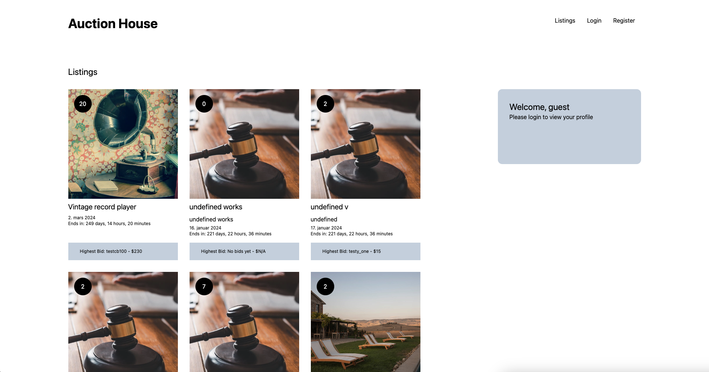

# Auction House



This is a semester project for Noroff. This is an auction site with simple functionality. My delivery was resit, and it was delivered late because of some unfortunate situations in my life. Therefore this delivery is far from my best, but has the instructed functionality as of user stories in the brief.

## Description

This project was a simple Auction House. It has bid functionality and auth functionality from the Noroff API.
It is built with vanilla javascript to prove to someone that vanilla JS still has a place in the world. You can log in and register with the auth api. You can also create, edit and delete your own listings if logged in. Also you can click in on a single auction and see the current bids, and who is selling what. 

If you have the highest bid when time runs out, you win the auction. 

The design is a bit too simple, and could need a overhaul. Let me know if you want to help. 


## Built With

This project was built on react.js and tailwind CSS. It also use Noroff API v2

- [TailwindCSS](https://tailwindcss.com)
- [NoroffAPI](https://docs.noroff.dev/docs/v2)

## Getting Started

### Installing

1. Clone the repo:

```bash
git clone git@github.com:bettytro/semesterproject-elitro.git
```

2. Install the dependencies:

```
npm install
```

### Running

To open a development server, run the following command:

```bash
npm run dev
```


## Contributing

There is a lot of improvement to be made on this, so you are more than welcome to contribute.
 Add a PR, and I will look into it and merge if I find it interesting. I appreciate you contributing to my project, and will be forever thankful.

## Contact

You can contact me at elisabeth@darkwoodmedia.no

